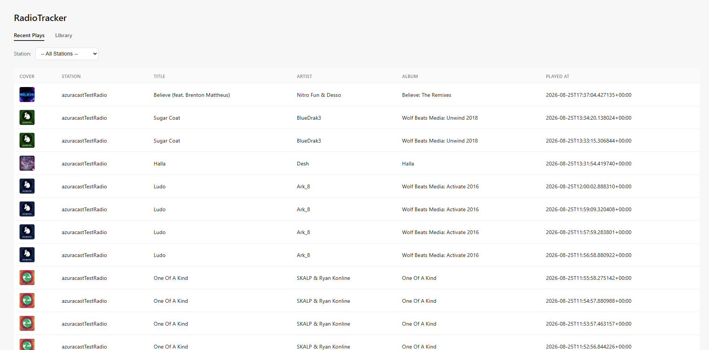
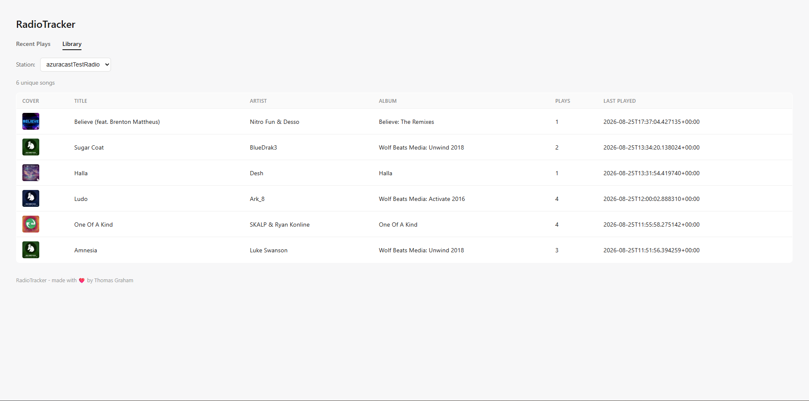

# radiotracker
Radio station tracker that collects nowplaying data and builds a database of it




GET STARTED!

Make sure to configure your install at config.json

```
git clone https://github.com/thesillycat/radiotracker
pip install -r requirements.txt
python3 run.py
